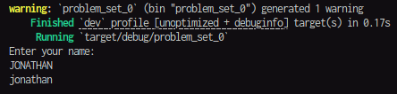
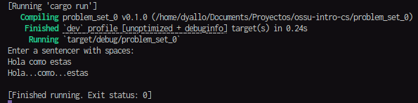

## Basado en:

https://cs50.harvard.edu/python/2022/psets/0/

### Indoor

```rs
// La idea es tomar el input de un usuario y mostrarlo en minusculas
fn indoor () {
    let mut input = String::new();

    println!("Enter your name: ");
    
    io::stdin().read_line(&mut input).expect("Failed to read line");
    
    println!("{}", input.to_lowercase());
}
```

#### Resultado



### Playback-Speed

```rs
// La idea es remplazar los espacios con ...
fn playback_speed () {
    let mut input = String::new();

    println!("Enter your name: ");
    
    io::stdin().read_line(&mut input).expect("Failed to read line");
    
    println!("{}", input.replace(" ", "..."));
}
```

#### Resultado

